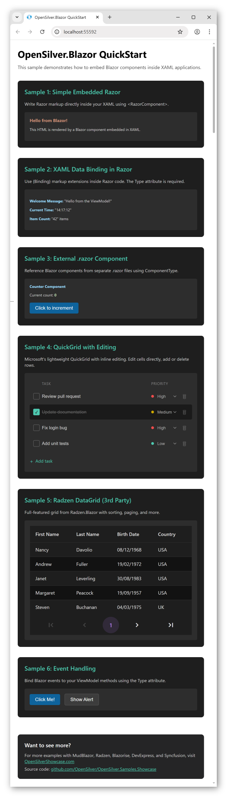

# OpenSilver.Blazor QuickStart

A sample project demonstrating how to embed **Blazor components directly inside XAML applications** using [OpenSilver](https://opensilver.net).


<!-- TODO: Add screenshot after running the app -->

## What This Sample Demonstrates

This project shows six progressive examples of Blazor integration in OpenSilver:

| Sample | Description |
|--------|-------------|
| **1. Simple Embedded Razor** | Write Razor markup directly inside XAML using `<RazorComponent>` |
| **2. Data Binding** | Use `{Binding}` markup extensions inside Razor code |
| **3. External .razor File** | Reference Blazor components from separate `.razor` files |
| **4. QuickGrid with Editing** | Microsoft's lightweight grid with inline editing (add/edit/delete) |
| **5. Radzen DataGrid** | Full-featured 3rd-party grid with sorting and paging |
| **6. Event Handling** | Bind Blazor events to ViewModel methods |

## Prerequisites

- [.NET 10 SDK](https://dotnet.microsoft.com/download/dotnet/10.0) or later
- [Visual Studio 2022/2026](https://visualstudio.microsoft.com/) with the [OpenSilver extension](https://marketplace.visualstudio.com/items?itemName=userware.OpenSilverSDK)
- or [VS Code](https://code.visualstudio.com/) with the [OpenSilver extension](https://marketplace.visualstudio.com/items?itemName=userware.vscode-opensilver)

## Getting Started

1. **Clone the repository:**
   ```bash
   git clone https://github.com/OpenSilver/OpenSilver_Blazor_QuickStart.git
   cd OpenSilver_Blazor_QuickStart
   ```

2. **Open the solution:**
   - Open `OpenSilver_Blazor_QuickStart.slnx` in Visual Studio or VS Code

3. **Set the startup project:**
   - Set `OpenSilver_Blazor_QuickStart.Browser` as the startup project

4. **Run the application:**
   - Press F5 or click the Run button

## Project Structure

```
OpenSilver_Blazor_QuickStart/
├── OpenSilver_Blazor_QuickStart/           # Main OpenSilver project
│   ├── MainPage.xaml                       # Main UI with all samples
│   ├── MainPage.xaml.cs                    # ViewModel with data binding
│   ├── Counter.razor                       # Simple counter component (Sample 3)
│   ├── EditableTaskGrid.razor              # Editable QuickGrid component (Sample 4)
│   └── Employee.cs                         # Sample data for Radzen grid
├── OpenSilver_Blazor_QuickStart.Browser/   # WebAssembly host project
│   ├── Program.cs                          # Entry point with Blazor init
│   └── wwwroot/index.html                  # HTML host page
└── OpenSilver_Blazor_QuickStart.Simulator/ # Windows simulator project
```

## Key Concepts

### 1. Embedding Razor Code in XAML

Write Razor markup directly inside your XAML using the `<RazorComponent>` tag:

```xml
<razor:RazorComponent>
    <h3>Hello from Blazor!</h3>
    <p>This HTML is rendered by Blazor inside XAML.</p>
</razor:RazorComponent>
```

### 2. Data Binding with Type Attribute

Use XAML `{Binding}` syntax inside Razor code. **The `Type` attribute is required:**

```xml
<razor:RazorComponent>
    <p>Message: "{Binding WelcomeMessage, Type=String}"</p>
    <RadzenButton Click="{Binding OnClick, Type=Action}" />
</razor:RazorComponent>
```

### 3. Referencing External .razor Files

Create standard Blazor components in `.razor` files and reference them from XAML:

```xml
<razor:RazorComponent ComponentType="{x:Type local:Counter}" />
```

> **Note:** Make sure the Build Action of `.razor` files is set to `Content`.

### 4. Using Microsoft QuickGrid

[QuickGrid](https://learn.microsoft.com/en-us/aspnet/core/blazor/components/quickgrid) is Microsoft's official lightweight data grid:

```xml
<razor:RazorComponent ComponentType="{x:Type local:EditableTaskGrid}" />
```

QuickGrid supports sorting, pagination, and custom templates for inline editing.

### 5. Using 3rd-Party Blazor Libraries

This sample also uses [Radzen.Blazor](https://blazor.radzen.com/). Setup requires:

1. Add the NuGet package to your project
2. Add the JS script in `index.html`:
   ```html
   <script src="_content/Radzen.Blazor/Radzen.Blazor.js"></script>
   ```
3. Register services in `Program.cs`:
   ```csharp
   builder.Services.AddRadzenComponents();
   ```

## Known Limitations

- **Design-time errors:** Razor code embedded in XAML shows errors in Visual Studio at design-time but compiles and runs correctly. Workarounds:
  - Use CDATA sections around Razor code
  - Place Razor code in separate `.razor` files
  - Select "Build Only" in the Error List window

- **Language support:** OpenSilver.Blazor works with C# projects only. For VB.NET/F# projects, create a separate C# class library for Razor files.

- **Launcher support:** Works with `.Browser`, `.MauiHybrid`, and `.Simulator` launchers. Best stability with `.Browser`.

For full documentation, see: [OpenSilver.Blazor Documentation](https://doc.opensilver.net/documentation/general/opensilver-blazor.html)

## More Examples

This QuickStart covers the basics. For more advanced examples with additional Blazor libraries, visit:

- **OpenSilver Showcase:** [OpenSilverShowcase.com](https://opensilvershowcase.com)
- **Showcase Source Code:** [github.com/OpenSilver/OpenSilver.Samples.Showcase](https://github.com/OpenSilver/OpenSilver.Samples.Showcase)

The Showcase includes samples for:
- **MudBlazor** - Material Design components
- **Radzen** - Data grids, charts, forms
- **Blazorise** - Bootstrap/Bulma/Material components
- **DevExpress Blazor** - Enterprise components
- **Syncfusion Blazor** - 80+ UI components

## Resources

- [OpenSilver Website](https://opensilver.net)
- [OpenSilver Documentation](https://doc.opensilver.net)
- [OpenSilver GitHub](https://github.com/OpenSilver/OpenSilver)
- [XAML.io - Online IDE](https://xaml.io)

## License

This sample is provided under the MIT License.
